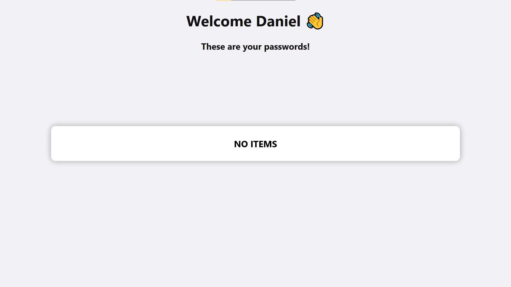

# Praktikum_2022_Feb


## Setup:
1. Check if python is installed.
```
$ python --version
```
* If python is not installed, install it from this (website)[https://www.python.org/downloads/release/python-3810/]
* ℹ Choose the advanced installation to enable pip.

2. Check if git is installed.
```
$ git --verison
```
If git is not installed, install it from this (website)[https://gitforwindows.org/]

3. Open a terminal in your prefered folder for coding projects.

4. Clone the repository.
```
$ git clone https://github.com/LucaKuechler/Praktikum_2022_Feb.git
```

5. Change into the downloaded folder.
```
$ cd Praktikum_2022_Feb
```

6. Install all python dependencies.
```
$ pip install -r requirements.txt
```

7. Change into the src folder.
```
cd src
```

8. Execute the pyhton script for the first time.
```
$ python main.py
```
⚠ Do not close the terminal!

9. Open http://127.0.0.1:3333/ inside your internet browser.


## Day 1:
- [ ] Run the program for the first time.
- [ ] Create a sqlite3 database with the name "db.sqlite3" inside the src folder.
- [ ] Complete the setup.py script inside the setup folder.
- [ ] Read credential data from database and display it in frontend (files are located in src folder).

## Day 2:
- [ ] Create a authentification page that asks for a password before the user can see any data.
- [ ] Store your Password as hash value inside your code and compare it with the given passwords hash value.
- [ ] Delete your db.sqlite3 file and recreate it.
- [ ] Store hashed passwords in your database instead of clear passwords. Add this functionality in setup.py.
- [ ] Run the modified setup.py file and check if it worked.
- [ ] When reading the database data (db_operations.py) decrypt the password before sending it to the frontend.


## Day 3:
- [ ]  Delete/Insert User from DB using your web forms.

## Day 4:
- [ ] Docker introduction
- [ ] Hosting / containerizing
